# Tuple Domain Class Diagram

```mermaid
classDiagram
    %% Definition Package
    class TupleDefinition {
        <<interface>>
        +packageName() String
        +name() String
        +node() Object
    }

    class NamedTupleDefinition {
        +packageName: String
        +name: String
        +fieldDefinitions: List~NamedFieldDefinition~
        +node: Object
    }

    class NumberedTupleDefinition {
        +packageName: String
        +name: String
        +size: int
        +node: Object
    }

    class NamedFieldDefinition {
        +name: String
        +type: Optional~String~
        +node: Object
    }

    TupleDefinition <|.. NamedTupleDefinition
    TupleDefinition <|.. NumberedTupleDefinition
    NamedTupleDefinition --> NamedFieldDefinition : contains

    %% Signature Package
    class Signature {
        +methodNomenclature: MethodNomenclature
        +arguments: List~Argument~
        +node: Object
    }

    class MethodNomenclature {
        +packageName: String
        +className: String
        +methodName: String
    }

    class Type {
        +value: String
        +innerType: Optional~Type~
    }

    Signature --> MethodNomenclature : has
    Signature --> Argument : contains multiple
    Type --> Type : recursive

    %% Argument Package
    class Argument {
        <<interface>>
        +node() Object
    }

    class SimpleArgument {
        +type: Optional~Type~
        +node: Object
    }

    class LambdaArgument {
        +name: String
        +type: Optional~Type~
        +node: Object
    }

    class TypeRefArgument {
        +name: String
        +node: Object
    }

    Argument <|.. SimpleArgument
    Argument <|.. LambdaArgument
    Argument <|.. TypeRefArgument
    SimpleArgument --> Type : uses
    LambdaArgument --> Type : uses

    %% Javac Package
    class TupleScanner {
        <<abstract>>
        +scan(Consumer~Signature~)*
    }

    TupleScanner --> Signature : produces

    %% Spec Package
    class TupleSpec {
        <<abstract>>
        +hasMatchingSignature(Signature): boolean
        #targetMethodNomenclature()* MethodNomenclature
        #hasMatchingArguments(List~Argument~)* boolean
        +process(Signature)* TupleDefinition
    }

    class NamedTupleSpec {
        +hasMatchingArguments(List~Argument~): boolean
        +process(Signature): NamedTupleDefinition
    }

    class NumberedTupleSpec {
        +hasMatchingArguments(List~Argument~): boolean
        +process(Signature): NumberedTupleDefinition
    }

    class TupleExtensionSpec {
        <<abstract>>
        +generateExtensionMethod(T): String
        #tupleExtensionGenerator()* TupleExtensionGenerator
    }

    TupleSpec --> Signature : analyzes
    TupleSpec --> TupleDefinition : produces
    NamedTupleSpec --|> TupleSpec
    NumberedTupleSpec --|> TupleSpec
    TupleExtensionSpec --|> TupleSpec
    NamedTupleSpec --> NamedTupleDefinition : produces
    NumberedTupleSpec --> NumberedTupleDefinition : produces
    TupleExtensionSpec --> TupleExtensionGenerator : uses

    %% Code Generator Package
    class TupleClassGenerator {
        <<interface>>
        +generate(NamedTupleDefinition): String
        +generate(NumberedTupleDefinition): String
    }

    class TupleExtensionGenerator {
        <<interface>>
        +generate(TupleDefinition): String
    }

    class TupleFactoryGenerator {
        <<interface>>
        +generate(NamedTupleDefinition): String
        +generate(NumberedTupleDefinition): String
    }

    TupleClassGenerator --> NamedTupleDefinition : generates code from
    TupleClassGenerator --> NumberedTupleDefinition : generates code from
    TupleExtensionGenerator --> TupleDefinition : generates code from
    TupleFactoryGenerator --> NamedTupleDefinition : generates code from
    TupleFactoryGenerator --> NumberedTupleDefinition : generates code from

    %% Validator Package
    class TupleValidator {
        <<interface>>
        +validate(TupleDefinition): List~ValidationError~
        +validate(List~TupleDefinition~): List~ValidationError~
    }

    class ValidationError {
        +node: Object
        +errorMessage: String
    }

    TupleValidator --> TupleDefinition : validates
    TupleValidator --> ValidationError : produces

    %% Orchestrator
    class Orchestrator {
        -tupleSpecs: List~TupleSpec~
        -tupleScanner: TupleScanner
        -validators: List~Validator~
        -tupleClassGenerator: TupleClassGenerator
        -tupleFactoryGenerator: TupleFactoryGenerator
        +save()*
        -validate(List~TupleDefinition~): List~ValidationError~*
        -save(List~TupleDefinition~)*
    }

    Orchestrator --> TupleSpec : uses
    Orchestrator --> TupleScanner : uses
    Orchestrator --> TupleDefinition : processes
    Orchestrator --> TupleClassGenerator : uses
    Orchestrator --> TupleFactoryGenerator : uses

    %% Relationships annotation
    note "Records are shown as classes\nfor clarity in the diagram"
```

## Architecture Overview

The domain package contains the core architecture for handling named and numbered tuples:

### Key Components

1. **Definition Layer** (`definition/`)
   - `TupleDefinition`: Interface representing tuple metadata
   - `NamedTupleDefinition`: Record for named tuples with field definitions
   - `NumberedTupleDefinition`: Record for numbered tuples with size
   - `NamedFieldDefinition`: Record for field metadata in named tuples

2. **Specification Layer** (`spec/`)
   - `TupleSpec`: Abstract base class that matches signatures and produces definitions
   - `NamedTupleSpec`: Handles named tuple specifications
   - `NumberedTupleSpec`: Handles numbered tuple specifications
   - `TupleExtensionSpec`: Abstract base for extension generation

3. **Signature Layer** (`javac/signature/`)
   - `Signature`: Records method call information
   - `MethodNomenclature`: Records package, class, and method names
   - `Type`: Records type information with support for nested types
   - `Argument` interface with implementations: `SimpleArgument`, `LambdaArgument`, `TypeRefArgument`

4. **Scanner** (`javac/`)
   - `TupleScanner`: Abstract class for scanning and discovering tuple signatures

5. **Code Generation** (`codeGenerator/`)
   - `TupleClassGenerator`: Interface for generating tuple class code
   - `TupleExtensionGenerator`: Generic interface for extension generation
   - `TupleFactoryGenerator`: Interface for generating factory methods

6. **Validation** (`validator/`)
   - `TupleValidator`: Generic interface for validating definitions
   - `ValidationError`: Record for validation error details

7. **Orchestrator** (root)
   - Main coordinator that orchestrates scanning, specification matching, validation, and code generation
